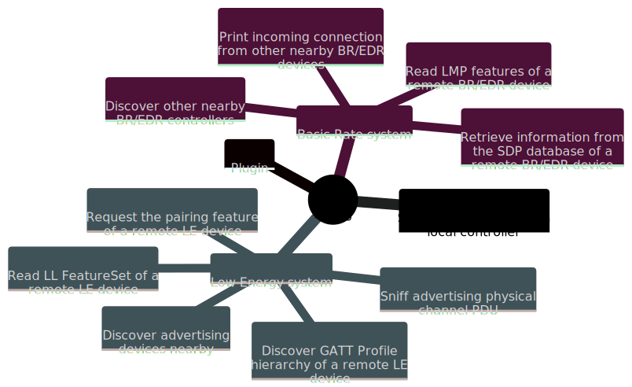

# Bluing: An intelligence gathering tool for hacking Bluetooth

<p align="center">
    <a href="https://fo-000.github.io/bluing/">English</a> · <a href="https://fo-000.github.io/bluing/index-cn.html">简体中文</a>
</p>

<p align="center">
    
    <a href="https://pypi.org/project/bluing/"></a>
    <a href="https://pepy.tech/badge/bluing"></a>
    <a href="https://pepy.tech/badge/bluescan"></a>
</p>

<p align="center">
    
</p>

Bluing (formerly [bluescan](https://pypi.org/project/bluescan/)) is a **Blu**etooth **In**telligence **G**athering tool written primarily in Python. It can help us snoop on the internal structure of Bluetooth which is a complex protocol, or hack Bluetooth devices. Here are the main features of the tool:


<!--  -->

## Install

Bluing partially depend on [BlueZ](http://www.bluez.org/), the official Linux Bluetooth protocol stack. So it only supports running on Linux. The following command is used to install dependencies:

```sh
sudo apt install python3-pip python3-dev libcairo2-dev libgirepository1.0-dev \
                 libbluetooth-dev libdbus-1-dev bluez-tools python3-cairo-dev \
                 rfkill meson patchelf bluez ubertooth adb
```

Currently, bluing is distributed via [PyPI](https://pypi.org/project/bluing/) and **only supports Python 3.10**. The following is an installation command:

```sh
sudo pip3.10 install bluing
```

## Hardware Requirements

### Bluetooth adapter

Many features of bluing require access to at least 1 Bluetooth adapter. Although it is possible to use the adapter that comes with the Linux physical machine or make the Linux virtual machine exclusive to an adapter of the host machine, it is still recommended to use an external USB Bluetooth adapter for more stability, such as [Parani UD100-G03](http://www.senanetworks.com/ud100-g03.html).

### Original micro:bit

Bluing requires at least 1 [original micro:bit](https://microbit.org/get-started/user-guide/overview/#original-micro:bit) when sniffing advertising physical channel PDUs ([`le --sniff-adv`](https://fo-000.github.io/bluing/#-sniff-adv-sniff-advertising-physical-channel-pdu)), and it is recommended to use 3 of them at the same time. These micro:bits need to run the dedicated firmware provided by bluing. After connecting the micro:bits to Linux, the pre-built firmware can be flashed by executing the following command:

```sh
bluing --flash-micro-bit
```

### Ubertooth One

When sniffing and guessing nearby BD_ADDRs ([`br --sniff-and-guess-bd-addr`](https://fo-000.github.io/bluing/#-sniff-and-guess-bd-addr-sniff-and-guess-nearby-bd_addrs-over-the-air)), bluing requires an [Ubertooth One](https://greatscottgadgets.com/ubertoothone/).

## Usage

> And God said, "Let there be **colorful**", and there was [**colorful**](https://fo-000.github.io/bluing/#usage).

<pre>
$ <span style="font-weight: bold; color: #9fab76">bluing</span> --help
An intelligence gathering tool for hacking Bluetooth

Usage:
    bluing [-h | --help]
    bluing (-v | --version)
    bluing [-i &lthci>] --clean BD_ADDR
    bluing [-i &lthci>] --spoof-bd-addr BD_ADDR
    bluing --flash-micro-bit
    bluing &ltcommand> [&ltargs>...]

Arguments:
    BD_ADDR    Bluetooth device address

Options:
    -h, --help           Print this help and quit
    -v, --version        Print version information and quit
    -i &lthci>             HCI device
    --clean              Clean cached data of a remote device
    --spoof-bd-addr      Spoof the BD_ADDR of a local controller
    --flash-micro-bit    Download the dedicated firmware to micro:bit(s)

Commands:
    br        Basic Rate system, includes an optional Enhanced Data Rate (EDR) extension
    le        Low Energy system
    plugin    Manage plugins

Run `bluing &ltcommand> --help` for more information on a command.
</pre>

### `--spoof-bd-addr`: Spoof the BD_ADDR of a local controller

<pre>
$ sudo <span style="font-weight: bold; color: #9fab76">bluing</span> --spoof-bd-addr AA:BB:CC:DD:EE:FF
[<span style="font-weight: bold; color: #ecc179">WARNING</span>] The original HCI device number may have been changed
[<span style="font-weight: bold; color: #7da9c7">INFO</span>] BD_ADDR changed: 11:22:33:44:55:66 -&gt; <span style="font-weight: bold; color: #7da9c7">AA:BB:CC:DD:EE:FF</span>
</pre>

### `br` command: Basic Rate system

<pre>
$ <span style="font-weight: bold; color: #9fab76">bluing</span> br --help

Usage:
    bluing br [-h | --help]
    bluing br [-i &lthci>] [--inquiry-len=&ltn>] --inquiry
    bluing br [-i &lthci>] --sdp BD_ADDR
    bluing br [-i &lthci>] --local --sdp
    bluing br [-i &lthci>] --lmp-features BD_ADDR
    bluing br [-i &lthci>] --local --lmp-features
    bluing br [-i &lthci>] --stack BD_ADDR
    bluing br [-i &lthci>] --local --stack
    bluing br [-i &lthci>] [--inquiry-scan] --mon-incoming-conn
    bluing br --org=&ltname> --timeout=&ltsec> --sniff-and-guess-bd-addr

Arguments:
    BD_ADDR    BR/EDR Bluetooth device address

Options:
    -h, --help                   Print this help and quit
    -i &lthci>                     HCI device
    --local                      Target a local BR/EDR device instead of a remote one
    --inquiry                    Discover other nearby BR/EDR controllers
    --inquiry-len=&ltn>            Maximum amount of time (added to --ext-inquiry-len=&ltn>) 
                                 specified before the Inquiry is halted.
                                     Time = n * 1.28 s
                                     Time range: 1.28 to 61.44 s
                                     Range of n: 0x01 to 0x30 [default: 8]
    --ext-inquiry-len=&ltn>        Extended_Inquiry_Length measured in number of 
                                 Baseband slots.
                                     Interval Length = n * 0.625 ms (1 Baseband slot)
                                     Time Range: 0 to 40.9 s
                                     Range of n: 0x0000 to 0xFFFF [default: 0]
    --sdp                        Retrieve information from the SDP database of a 
                                 remote BR/EDR device
    --lmp-features               Read LMP features of a remote BR/EDR device
    --stack                      Determine the Bluetooth stack type of a remote BR/EDR device
    --mon-incoming-conn          Print incoming connection from other nearby BR/EDR devices
    --inquiry-scan               Enable the Inquiry Scan
    --sniff-and-guess-bd-addr    Sniff SAPs of BD_ADDRs over the air, then guess the 
                                 address based on the organization name. Need at 
                                 least one Ubertooth device
    --org=&ltname>                 An organization name in the OUI.txt
    --timeout=&ltsec>              Timeout in second(s)
</pre>

#### `--inquiry`: Discover other nearby BR/EDR controllers

<pre>
$ <span style="font-weight: bold; color: #9fab76">sudo bluing</span> br --inquiry
[<span style="font-weight: bold; color: #7da9c7">INFO</span>] Discovering other nearby BR/EDR Controllers on <span style="font-weight: bold; color: #7da9c7">hci0</span> for <span style="font-weight: bold; color: #7da9c7">10.24</span> sec

BD_ADDR: <span style="font-weight: bold; color: #7da9c7">B0:C9:52:45:33:13</span> (<span style="font-weight: bold; color: #7da9c7">GUANGDONG OPPO MOBILE TELECOMMUNICATIONS CORP.,LTD</span>)
Page scan repetition mode: 1 (R1)
Reserved: 0x02
CoD: 0x5a020c
    Service Class: 0b1011010000
        Telephony
        Object Transfer
        Capturing
        Networking
    Major Device Class: 0b00010, <span style="font-weight: bold; color: #7da9c7">Phone</span>
Clock offset: 0x50D5
RSSI: -61
Extended inquiry response: 
    Complete Local Name: <span style="font-weight: bold; color: #7da9c7">old man phone</span>
    Complete List of 16-bit Service Class UUIDs
        0x1105 <span style="font-weight: bold; color: #7da9c7">OBEXObjectPush</span>
        0x110a <span style="font-weight: bold; color: #7da9c7">AudioSource</span>
        0x110c <span style="font-weight: bold; color: #7da9c7">A/V_RemoteControlTarget</span>
        0x110e <span style="font-weight: bold; color: #7da9c7">A/V_RemoteControl</span>
        0x1112 <span style="font-weight: bold; color: #7da9c7">Headset - Audio Gateway (AG)</span>
        0x1115 <span style="font-weight: bold; color: #7da9c7">PANU</span>
        0x1116 <span style="font-weight: bold; color: #7da9c7">NAP</span>
        0x111f <span style="font-weight: bold; color: #7da9c7">HandsfreeAudioGateway</span>
        0x112d <span style="font-weight: bold; color: #7da9c7">SIM_Access</span>
        0x112f <span style="font-weight: bold; color: #7da9c7">Phonebook Access - PSE</span>
        0x1200 <span style="font-weight: bold; color: #7da9c7">PnPInformation</span>
        0x1132 <span style="font-weight: bold; color: #7da9c7">Message Access Server</span>
    Complete List of 32-bit Service Class UUIDs
        <span style="font-weight: bold; color: #c35956">None</span>
    Complete List of 128-bit Service Class UUIDs
        <span style="font-weight: bold; color: #7da9c7">A49EAA15-CB06-495C-9F4F-BB80A90CDF00</span>
        <span style="font-weight: bold; color: #7da9c7">00000000-0000-0000-0000-000000000000</span>
... ...


[<span style="font-weight: bold; color: #7da9c7">INFO</span>] Requesting the names of all discovered devices...
B0:C9:52:45:33:13 : <span style="font-weight: bold; color: #7da9c7">old man phone</span>
... ...
</pre>

#### `--sdp`: Retrieve information from the SDP database of a remote BR/EDR device

<pre>
$ <span style="font-weight: bold; color: #9fab76">sudo bluing</span> br --sdp 34:13:46:23:6A:4D
Scanning <span style="font-weight: bold"></span><span style="font-weight: bold; color: #00aaaa">⠋</span>
Number of service records: 18 

<span style="font-weight: bold; color: #7da9c7">Service Record</span>
0x0000: ServiceRecordHandle (uint32)
	0x0001000d
0x0001: ServiceClassIDList (sequence)
	0x1105: <span style="font-weight: bold; color: #9fab76">OBEXObjectPush</span>
0x0004: ProtocolDescriptorList (sequence)
	0x0100: L2CAP
	0x0003: RFCOMM
		channel: 0x0c
	0x0008: OBEX
0x0005: BrowseGroupList (sequence)
	0x1002: <span style="font-weight: bold; color: #9fab76">PublicBrowseRoot</span>
0x0009: BluetoothProfileDescriptorList (sequence)
	0x1105: <span style="font-weight: bold; color: #9fab76">OBEXObjectPush</span> <span style="font-weight: bold; color: #9fab76">v1.2</span>
0x0100: ServiceName (guess) (text)
	OBEX Object Push 
0x0200: GoepL2CapPsm (guess) (uint16)
<span style="font-weight: bold; color: #9fab76">	0x1023</span>
0x0303: SupportedFormatsList (guess) (sequence)
	0x01: <span style="font-weight: bold; color: #9fab76">vCard 2.1</span>
	0x02: <span style="font-weight: bold; color: #9fab76">vCard 3.0</span>
	0x03: <span style="font-weight: bold; color: #9fab76">vCal 1.0</span>
	0x04: <span style="font-weight: bold; color: #9fab76">iCal 2.0</span>
	0xff: <span style="font-weight: bold; color: #9fab76">Any type of object</span>
... ...
</pre>

#### `--lmp-features`: Read LMP features of a remote BR/EDR device

<pre>
$ <span style="font-weight: bold; color: #9fab76">sudo bluing</span> br --lmp-features 6A:8D:99:33:56:AE
<span style="font-weight: bold; color: #7da9c7">Version</span>
    Version:
        Bluetooth Core Specification 5.2 (LMP)
        Bluetooth Core Specification 5.2 (LL)
    Manufacturer name: <span style="font-weight: bold; color: #9fab76">HiSilicon Technologies CO., LIMITED</span>
    Subversion: 33561 

<span style="font-weight: bold; color: #7da9c7">LMP features</span>
    3 slot packets: <span style="font-weight: bold; color: #9fab76">True</span>
    5 slot packets: <span style="font-weight: bold; color: #9fab76">True</span>
    Encryption: <span style="font-weight: bold; color: #9fab76">True</span>
    Slot offset: <span style="font-weight: bold; color: #9fab76">True</span>
    Timing accuracy: <span style="font-weight: bold; color: #9fab76">True</span>
    Role switch: <span style="font-weight: bold; color: #9fab76">True</span>
    Hold mode: <span style="font-weight: bold; color: #c35956">False</span>
    Sniff mode: <span style="font-weight: bold; color: #9fab76">True</span>
    Previously used: <span style="font-weight: bold; color: #c35956">False</span>
    Power control requests: <span style="font-weight: bold; color: #9fab76">True</span>
    Channel quality driven data rate (CQDDR): <span style="font-weight: bold; color: #9fab76">True</span>
    ... ...

<span style="font-weight: bold; color: #7da9c7">Extended LMP features</span>
Page 1
    Secure Simple Pairing (Host Support): <span style="font-weight: bold; color: #9fab76">True</span>
    LE Supported (Host): <span style="font-weight: bold; color: #9fab76">True</span>
    Simultaneous LE and BR/EDR to Same Device Capable (Host): <span style="font-weight: bold; color: #9fab76">True</span>
    Secure Connections (Host Support): <span style="font-weight: bold; color: #9fab76">True</span>
Page 2
    Connectionless Slave Broadcast - Master Operation: <span style="font-weight: bold; color: #c35956">False</span>
    Connectionless Slave Broadcast - Slave Operation: <span style="font-weight: bold; color: #c35956">False</span>
    Synchronization Train: <span style="font-weight: bold; color: #c35956">False</span>
    Synchronization Scan: <span style="font-weight: bold; color: #c35956">False</span>
    HCI_Inquiry_Response_Notification event:  <span style="font-weight: bold; color: #9fab76">True</span>
    ... ...
</pre>

#### `--mon-incoming-conn`: Print incoming connection from other nearby BR/EDR devices

<pre>
$ <span style="font-weight: bold; color: #9fab76">sudo bluing</span> br --inquiry-scan --mon-incoming-conn
[<span style="font-weight: bold; color: #7da9c7">INFO</span>] Inquiry_Scan_Interval: 4096, 2560.0 ms
       Inquiry_Scan_Window:   4096, 2560.0 ms
[<span style="font-weight: bold; color: #7da9c7">INFO</span>] Inquiry Scan and Page Scan enabled

<span style="font-weight: bold; color: #7da9c7">A0:DE:0F:99:EF:78</span> incoming
    CoD: 0x5a020c
        Service Class: 0b1011010000
                Telephony
                Object Transfer
                Capturing
                Networking
        Major Device Class: 0b00010, <span style="font-weight: bold; color: #7da9c7">Phone</span>
    link type: 0x01 - ACL
... ...
</pre>

#### `--sniff-and-guess-bd-addr`: Sniff and guess nearby BD_ADDRs over the air

<pre>
$ <span style="font-weight: bold; color: #9fab76">bluing</span> br --org=<span style="font-weight: bold; color: #eac179">'Huawei Device Co., Ltd.'</span> --timeout=600 --sniff-and-guess-bd-addr
[<span style="font-weight: bold; color: #7da9c7">INFO</span>] Possible BD_ADDR for ??:??:99:4C:45:C3
       24:A7:99:4C:45:C3

[<span style="font-weight: bold; color: #7da9c7">INFO</span>] Possible BD_ADDR for ??:??:E4:2D:69:EE
       BC:1A:E4:2D:69:EE
       D0:05:E4:2D:69:EE
       30:AA:E4:2D:69:EE

[<span style="font-weight: bold; color: #7da9c7">INFO</span>] Possible BD_ADDR for ??:??:15:60:81:7F
       64:23:15:60:81:7F
       D4:74:15:60:81:7F
... ...
</pre>

### `le` command: Low Energy system

<pre>
$ <span style="font-weight: bold; color: #9fab76">bluing</span> le --help

Usage:
    bluing le [-h | --help]
    bluing le [-i &lthci>] [--scan-type=&lttype>] [--timeout=&ltsec>] [--sort=&ltkey>] --scan
    bluing le [-i &lthci>] --pairing-feature [--timeout=&ltsec>] [--addr-type=&lttype>] PEER_ADDR
    bluing le [-i &lthci>] --ll-feature-set [--timeout=&ltsec>] [--addr-type=&lttype>] PEER_ADDR
    bluing le [-i &lthci>] --gatt [--io-cap=&ltname>] [--addr-type=&lttype>] PEER_ADDR
    bluing le [-i &lthci>] --local --gatt
    bluing le [-i &lthci>] --mon-incoming-conn
    bluing le [--channel=&ltnum>] --sniff-adv

Arguments:
    PEER_ADDR    LE Bluetooth device address

Options:
    -h, --help            Print this help and quit
    -i &lthci>              HCI device
    --scan                Discover advertising devices nearby
    --scan-type=&lttype>    The type of scan to perform. active or passive [default: active]
    --sort=&ltkey>          Sort the discovered devices by key, only support RSSI 
                          now [default: rssi]
    --ll-feature-set      Read LL FeatureSet of a remote LE device
    --pairing-feature     Request the pairing feature of a remote LE device
    --timeout=&ltsec>       Duration of the LE scanning, but may not be precise [default: 10]
    --gatt                Discover GATT Profile hierarchy of a remote LE device
    --io-cap=&ltname>       Set IO capability of the agent. Available value: 
                              DisplayOnly, DisplayYesNo, KeyboardOnly, NoInputNoOutput, 
                              KeyboardDisplay (KeyboardOnly) [default: NoInputNoOutput]
    --addr-type=&lttype>    Type of the LE address, public or random
    --sniff-adv           Sniff advertising physical channel PDU. Need at least 
                          one micro:bit
    --channel=&ltnum>       LE advertising physical channel, 37, 38 or 39 [default: 37,38,39]
</pre>

#### `--scan`: Discover advertising devices nearby

<pre>
$ <span style="font-weight: bold; color: #9fab76">sudo bluing</span> le --scan
[<span style="font-weight: bold; color: #ecc179">WARNING</span>] You might want to spoof your LE address before doing an active scan
[<span style="font-weight: bold; color: #7da9c7">INFO</span>] LE <span style="font-weight: bold; color: #7da9c7">active</span> scanning on <span style="font-weight: bold; color: #7da9c7">hci0</span> for <span style="font-weight: bold; color: #7da9c7">10</span> sec
Scanning <span style="font-weight: bold"></span><span style="font-weight: bold; color: #00aaaa">⠴</span>

<span style="font-weight: bold; color: #7da9c7">----------------LE Devices Scan Result----------------</span>
Addr:        <span style="font-weight: bold; color: #7da9c7">74:A3:4A:D4:78:55</span> (<span style="font-weight: bold; color: #7da9c7">ZIMI CORPORATION</span>)
Addr type:   <span style="font-weight: bold; color: #7da9c7">public</span>
Connectable: <span style="font-weight: bold; color: #9fab76">True</span>
RSSI:        -68 dBm
General Access Profile:
    Flags: 
        LE General Discoverable Mode
        BR/EDR Not Supported
    Service Data - 16-bit UUID: 
        UUID: 0x95FE
        Data: 9055990701b743e34aa3740e00
    Appearance: 0000
    Tx Power Level: 0 dBm (pathloss 68 dBm)
    Complete Local Name: Mesh Mi Switch
... ...
</pre>

#### `--ll-feature-set`: Read LL FeatureSet of a remote LE device

<pre>
$ <span style="font-weight: bold; color: #9fab76">sudo bluing</span> le --ll-feature-set --addr-type=public 18:D9:8F:77:24:F1
[<span style="font-weight: bold; color: #7da9c7">INFO</span>] Reading LL FeatureSet of <span style="font-weight: bold; color: #7da9c7">18:D9:8F:77:24:F1</span> on <span style="font-weight: bold; color: #7da9c7">hci0</span>
Reading <span style="font-weight: bold"></span><span style="font-weight: bold; color: #00aaaa">⠼</span>
<span style="font-weight: bold; color: #7da9c7">LE LL Features:</span>
    LE Encryption: <span style="font-weight: bold; color: #9fab76">True</span>
    Connection Parameters Request Procedure: <span style="font-weight: bold; color: #c35956">False</span>
    Extended Reject Indication: <span style="font-weight: bold; color: #c35956">False</span>
    Slave-initiated Features Exchange: <span style="font-weight: bold; color: #c35956">False</span>
    LE Ping: <span style="font-weight: bold; color: #c35956">False</span>
    LE Data Packet Length Extension: <span style="font-weight: bold; color: #9fab76">True</span>
    LL Privacy: <span style="font-weight: bold; color: #c35956">False</span>
    Extended Scanner Filter Policies: <span style="font-weight: bold; color: #c35956">False</span>
    LE 2M PHY: <span style="font-weight: bold; color: #c35956">False</span>
    Stable Modulation Index - Transmitter: <span style="font-weight: bold; color: #c35956">False</span>
    Stable Modulation Index - Receiver: <span style="font-weight: bold; color: #c35956">False</span>
    ... ...
</pre>

#### `--pairing-feature`: Request the pairing feature of a remote LE device

<pre>
$ <span style="font-weight: bold; color: #9fab76">sudo bluing</span> le --pairing-feature --addr-type=public 18:D9:8F:77:24:F1
[<span style="font-weight: bold; color: #7da9c7">INFO</span>] Requesting pairing feature of <span style="font-weight: bold; color: #7da9c7">18:D9:8F:77:24:F1</span> on <span style="font-weight: bold; color: #7da9c7">hci0</span>
Requesting <span style="font-weight: bold"></span><span style="font-weight: bold; color: #00aaaa">⠧</span>
<span style="font-weight: bold; color: #7da9c7">Pairing Response</span>
    IO Capability: 0x03 - <span style="font-weight: bold; color: #9fab76">NoInputNoOutput</span>
    OOB data flag: 0x00 - Not Present
    AuthReq: 0x01
    Maximum Encryption Key Size: 16
Initiator Key Distribution: 0x00
        EncKey:  <span style="font-weight: bold; color: #c35956">False</span>
        IdKey:   <span style="font-weight: bold; color: #c35956">False</span>
        SignKey: <span style="font-weight: bold; color: #c35956">False</span>
        LinkKey: <span style="font-weight: bold; color: #c35956">False</span>
        RFU:     0b0000
Responder Key Distribution: 0x01
        EncKey:  <span style="font-weight: bold; color: #9fab76">True</span>
        IdKey:   <span style="font-weight: bold; color: #c35956">False</span>
        SignKey: <span style="font-weight: bold; color: #c35956">False</span>
        LinkKey: <span style="font-weight: bold; color: #c35956">False</span>
        RFU:     0b0000
</pre>

#### `--gatt`: Discover GATT Profile hierarchy of a remote LE device

<pre>
$ <span style="font-weight: bold; color: #9fab76">sudo bluing</span> le --gatt --addr-type=public 18:D9:8F:77:24:F1
Connecting <span style="font-weight: bold"></span><span style="font-weight: bold; color: #00aaaa">⠋</span>
Discovering all primary services <span style="font-weight: bold"></span><span style="font-weight: bold; color: #00aaaa">⠏</span>
Discovering all characteristics of service 0x0001 <span style="font-weight: bold"></span><span style="font-weight: bold; color: #00aaaa">⠹</span>
... ...
Discovering all descriptors of characteristic 0x0002 <span style="font-weight: bold"></span><span style="font-weight: bold; color: #00aaaa">⠼</span>
... ...
Reading value of the descriptor 0x0013 <span style="font-weight: bold"></span><span style="font-weight: bold; color: #00aaaa">⠴</span>
... ... 

<span style="font-weight: bold; color: #7da9c7">----------------GATT Scan Result----------------</span>
Number of services: 6

<span style="font-weight: bold; color: #7da9c7">Service</span> (0x0100 - 0x0112, 7 characteristics)
    <span style="font-weight: bold; color: #7da9c7">Declaration</span>
    Handle: 0x0100
    Type:   2800 (Primary Service declaration)
    Value:  <span style="font-weight: bold; color: #9fab76">1812</span> (<span style="font-weight: bold; color: #9fab76">Human Interface Device</span>)
    Permissions: Read (no authen/author)

    <span style="font-weight: bold; color: #ecc179">Characteristic</span> (2 descriptors)
        <span style="font-weight: bold; color: #ecc179">Declaration</span>
        Handle: 0x010d
        Type:   2803 (Characteristic declaration)
        Value:
            Properties: <span style="font-weight: bold; color: #9fab76"></span>
            Handle:     <span style="font-weight: bold; color: #9fab76">0x010e</span>
            UUID:       <span style="font-weight: bold; color: #9fab76">2A4D</span> (<span style="font-weight: bold; color: #9fab76">Report</span>)
        Permissions: Read (no authen/author)

        <span style="font-weight: bold; color: #ecc179">Descriptor</span>
        Handle: <span style="font-weight: bold; color: #9fab76">0x010f</span>
        Type:   <span style="font-weight: bold; color: #9fab76">2902</span> (<span style="font-weight: bold; color: #ecc179">Client Characteristic Configuration declaration</span>)
        Value:  <span style="font-weight: bold; color: #9fab76">b'\x00\x00'</span>
        Permissions: Read (no authen/author), Write (higher layer specifies authen/author)
... ...
</pre>

#### `--sniff-adv`: Sniff advertising physical channel PDU

<pre>
$ <span style="font-weight: bold; color: #9fab76">sudo bluing</span> le --sniff-adv
[<span style="font-weight: bold; color: #7da9c7">INFO</span>] Using micro:bit /dev/ttyACM2 on channel 37
[<span style="font-weight: bold; color: #7da9c7">INFO</span>] Using micro:bit /dev/ttyACM1 on channel 38
[<span style="font-weight: bold; color: #7da9c7">INFO</span>] Using micro:bit /dev/ttyACM0 on channel 39
[<span style="font-weight: bold; color: #7da9c7">INFO</span>] micro:bit 38 < Ready -> Start
[<span style="font-weight: bold; color: #7da9c7">INFO</span>] micro:bit 37 < Ready -> Start
[<span style="font-weight: bold; color: #7da9c7">INFO</span>] micro:bit 39 < Ready -> Start
[38] [<span style="font-weight: bold; color: #c35956">ADV_NONCONN_IND</span>]
random AdvA: 28:7A:88:B2:35:0B
[39] [<span style="font-weight: bold; color: #7da9c7">ADV_IND</span>]
public AdvA: A4:E4:72:B1:CB:8D
[37] [<span style="font-weight: bold; color: #7da9c7">SCAN_REQ</span>]
random ScanA: 6A:90:0C:07:3E:14
random AdvA: 7D:9B:A8:5A:F2:81
... ...
</pre>

### `android` command: Android Bluetooth stack

<pre>
$ <span style="font-weight: bold; color: #9fab76">bluing</span> android --help

Usage:
    bluing android [-h | --help]
    bluing android [-t &ltid>] --collect-btsnoop-log [-o &ltfile>]

Options:
    -h, --help               Display this help and quit
    -t &ltid>                  Use android device with given transport id. This option 
                             will be ignored when only one device is available
    --collect-btsnoop-log    Collect the btsnoop log being generated to a local file, 
                             default ./btsnoop_hci.log
    -o &ltfile>                Place the output into <file> [default: ./btsnoop_hci.log]
</pre>

#### `--collect-btsnoop-log`: Collect the btsnoop log being generated

<pre>
$ <span style="font-weight: bold; color: #9fab76">bluing</span> android -t 3 --collect-btsnoop-log -o btsnoop_hci.log
$ <span style="font-weight: bold; color: #9fab76">file</span> btsnoop_hci.log
btsnoop_hci.log: BTSnoop version 1, HCI UART (H4)
</pre>

### `plugin` command: Manage plugins

<pre>
$ <span style="font-weight: bold; color: #9fab76">bluing</span> plugin --help

Usage:
    bluing plugin [-h | --help]
    bluing plugin &ltcommand> [&ltargs>...]

Options:
    -h, --help    Display this help and quit

Commands:
    list         List installed plugins
    install      Install a plugin
    uninstall    Uninstall a plugin
    run          Run a plugin
</pre>

## FAQ

### `rfkill` cannot find hci0

The following is the exception message:

```txt
Exception: Can't find the ID of hci0 in rfkill
```

This exception may be caused by the lack of support for `-r` and `-n` option in the old version of rfkill, for example:
  
<pre>
$ <span style="font-weight: bold; color: #9fab76">cat</span> /etc/os-release | <span style="font-weight: bold; color: #9fab76">head</span> -n 2
NAME="Ubuntu"
VERSION="16.10 (Yakkety Yak)"

$ <span style="font-weight: bold; color: #9fab76">rfkill</span> --version
rfkill 0.5-1ubuntu3 (Ubuntu)
</pre>

At this time, upgrading rfkill to a newer version can solve the problem, such as:

<pre>
$ <span style="font-weight: bold; color: #9fab76">cat</span> /etc/os-release | <span style="font-weight: bold; color: #9fab76">head</span> -n 2
PRETTY_NAME="Kali GNU/Linux Rolling"
NAME="Kali GNU/Linux"

$ <span style="font-weight: bold; color: #9fab76">rfkill</span> --version
rfkill from util-linux 2.38.1
</pre>

### Management command `scanend` failed to execute

The following is an error message:

```txt
ERROR: Failed to execute management command 'scanend' (code: 11, error: Rejected)
```

Try restarting the Bluetooth service to solve the problem:

<pre>
<span style="font-weight: bold; color: #9fab76">sudo systemctl</span> restart bluetooth.service
</pre>
